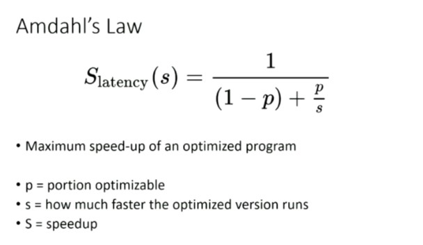
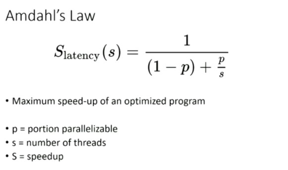

# Lecture 1

#### Race conditon example

Thread 1
`x = 3`

Thread 2
`y=x`

What are the possible values of y ? **Ans** = 0 , 3 or some random value

### What is Datarace?
Two threads access the same memory location and atleast one of them is a write (conflict)

### Why is parallel programming harder than sequential programming
1. Easy to write bugs (Dataraces)
2. Hard to find bugs (non-deterministic bugs. During the execution, the bugs may or may not occur)
3. Easy to have underperforming code (weird hardware issues)

### Parallel Processing
Multiple processors co-operate to process a related set of tasks

### Issues with Parallelism
1. **Decomposition** : Dividing the problem into smaller components
2. Requires some form of communication of synchronization to manage the problem

**Parallel and Concurrent are the same terminologies**

# Lecture 2

### Shared Memory 
Parallelism confined to a single (multi-core) machine

### Distributed System
Parallelism across a network of machines

### Scale Up (Buy Bigger)
Buy better serves, larger drives, larger multi-core, larger memory.
Typically consists of one (or a few) powerful machines

### Scale Out (Buy Better)
More cheap servers, drives, memory
Typically many machines on the network

### Decomposition
Breaking down the program into constituent components or tasks that are ***independent**

Independent components do not rely on each other's result

#### Example of Decomposition
To find out a word in a corpus of documents (e.g Library of books)


```
for each book in library:
    for each word in book:
        hashmap[word] ++
```

### Throughput
Number of operations per unit time

Operation:
1. Data Transfer
   Throughput = Bandwidth
   How much data can I send in particular unit of time
2. Instruction
   Throughput = IPS (Instructions Per second)
   How many instructions can be processed is a measure of of throughput
3. IO Device Access
   Throughput = IOPS
4. Floating Point Operation
   Throughput = FLOPS


### Latency
Time to operation completion

### Concurrency
Number of outstanding operations or the number of operations running in parallel

### Examples
1. Internet Speed
Throughput / Bandwidth = How much can I download in a particular unit of time
Latency = How quickly can I download the first packet

2. Cars on highway
   Throughput = Number of lanes on the highway
   Latency = How long does a car take to start and finish

### Throughput vs Latency

#### Sequential Programs
For sequential programs, the concurrency is 1. At any point only 1 process can execute.

**1 / latency = Throughput**

#### Parallel Programs

##### Little's law
**Concurrency / Latency = Bandwidth**

### Amdahl's Law





What are good strategies for Paralleization. Using Amdahl's law, p =~ 1


