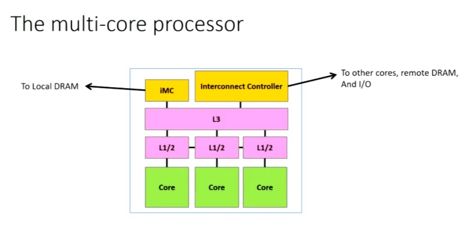
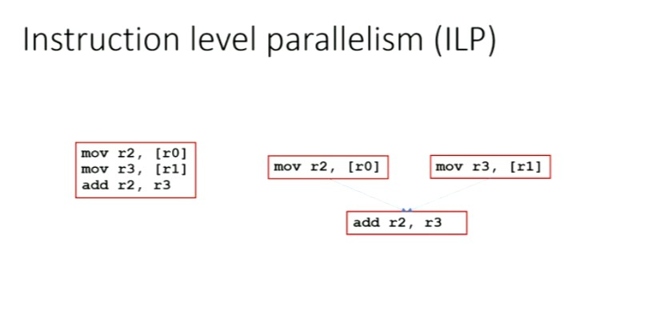
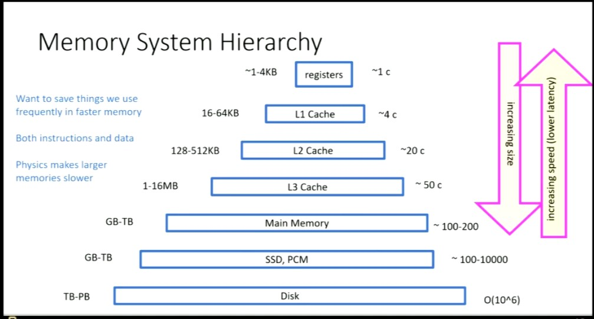
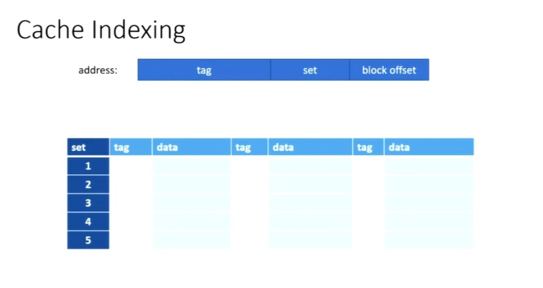

# Lecture 3
## Computer Organization

### MultiCore Processor

### Instruction Level Parallelism

ILP is at **run time**
The CPU can execution the instructions in **parallel** and also **out of order**

**Threads are an example ILP**

### Simultaneous Multi-Threading (Hyper Threading)
Running two threads on the same core
Since the threads are never dependent on each other, stalling can be reduced. Threads are modelled in such a way so as to have independent code.

## Memory Hierarchy

The Hot data is usually kept close to the CPU (Ideally in the registers or in the caches)
This is determined by the OS

## Cache
Most architectures use **64 byte cache line**

### Coherent vs Non-coherent Cache
In Coherent sytems, only 1 modifiable copy of the cache-line at any time is maintained

### Inclusive vs Exclusive Caches
1. Inclusive : Contains all cache line that its descendents contain
   Mostly architectures are **Inclusive**
2. Exclusive : Do not contain all cache line that its descendents contain

#### Cache Line
Smallest unit of memory that can migrate between DRAM and cache and between the caches

# Lecture 4

## NUMA
Due to system design, not all DRAMs have the same latency. This is referred as **NUMA**

## Cache Indexing

If the address load is not found in the cache, the data is fetched from DRAM
Cache Misses are **expensive**

### 3C's of Cache Misses
1. Cold Miss : First time we are using the data
2. Capacity Miss : Not enough room, cache is not big enough to store the data (Possibly more than 64 byte cache line)
3. Conflict Miss : Too many set aliases

### Prefetching
Caches prefetch lines.

1. Stream - Fetch the next line
   E.g - Array
   Traversals are cheap due to prefetching
2. Stride - Skip the same amount everytime
   E.g - Column Access in 2D Array

### Cache Locality
How effectively we can use Cache

1. Temporal - Something we used recently we will reuse again
2. Spatial - Something we used will be near something else we will use

