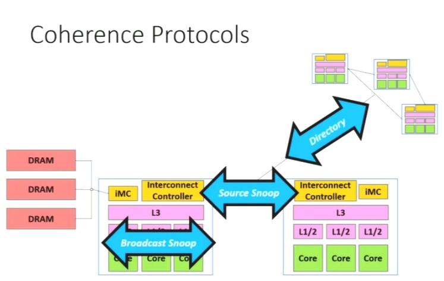

# Cache Coherence Protocols

A memory location is Coherent if:
1. All threads see the same **sequence of values** at that location
2. Coherence is not about values at different locations

Coherence guarantees:
1. **Write Propagation** : Updates will propagate to all other processors
2. **Write Serialization** : provide a consistent total write order seen by all processors

All shared memory systems enforce coherence **Cache Lines**

**Read only** - Non modifiable cache line 
If a core wants to write to the cache line, it needs to invalidate read-only copies to ensure no core reads stale data

**Write Update**: All shared copies get updated
**Write Invalidate**: Ensure there is only 1 copy by invalidation, then update it

# Snoopy Protocols
1. Broadcast - Within Single Socket
2. Source - Inter Socket

# Directory - Large Networks

# Broadcast Snoop Protocols
Generally within a single socket
All nodes hear all requests (snoop)

Common Protocols withing BSP:
1. MSI
2. MESI

Modified, Shared, Invalid, Exclusive

# Source Snoop
Point-to-point network
QPI,MESIF

# Directory
For very large network of nodes
Point-to-point network

Cahce-lines reside at a home node
Directory at home node keep track of where cache lines are

