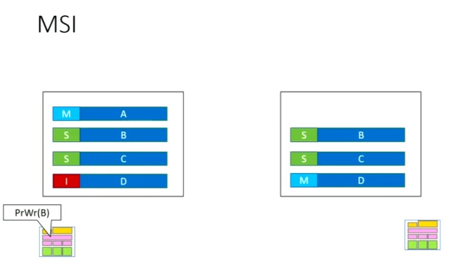

# MSI Protocol

Simplest Broadcast Snoop Protocol

Cache Lines can be in one of the states:
1. Modified - There has been a write or is about to write
2. Shared - Read only access
3. Invalid

## Transaction 1
Core 1 wants to write on Line B (PrWr(B))
Since Line B is shared not write access. So raise an event in the bus - **Bus Up (Upgrade)**
Core 2 will invalidate Line B
Core 1 will update B and change the state to modifiable

# Events
* [PrRd] (#PrRd)
* [PrWr] (#PrWr)